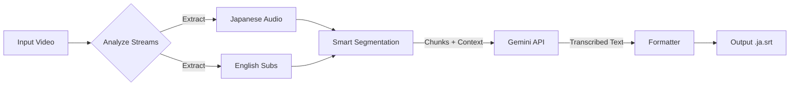

# JimakuGen (字幕Gen)


**JimakuGen** is an AI-powered tool that generates Japanese subtitles for video files. It uniquely leverages **English subtitles as context** to help the Google Gemini API transcribe Japanese audio with significantly higher accuracy than standard speech-to-text models.

> **Why "JimakuGen"?**
> "Jimaku" (字幕) means "subtitles" in Japanese.

---

## 🚀 Why JimakuGen?

Standard speech recognition often struggles with homophones and context-dependent Kanji in Japanese. By feeding the model the **English translation** of what is being said, JimakuGen provides the AI with the "ground truth" of the meaning, allowing it to:
1.  **Disambiguate Homophones:** Distinguish between *kumo* (cloud) and *kumo* (spider) based on context.
2.  **Correct Kanji Selection:** Choose the right characters for names and specialized terms.
3.  **Speaker Separation:** Understand who is likely speaking based on the dialogue structure.

### The Context Advantage
| Audio | Without Context | **With JimakuGen** |
| :--- | :--- | :--- |
| *"Hashi wo motte"* | 箸を持って (Take the chopsticks) | **橋を持って (Take the bridge)** *<-- inferred from English "Take the bridge"* |

---

## 🛠️ How It Works

JimakuGen automates a complex pipeline to ensure the best results:



1.  **Stream Analysis**: Uses `ffprobe` to find the main Japanese audio and the best English subtitle track (ignoring "Songs/Signs" tracks).
2.  **Smart Segmentation**: Splits the media into ~60s chunks, respecting silence gaps to avoid cutting sentences.
3.  **Context Fusion**: Sends the audio chunk *plus* the aligned English subtitles to Gemini.
4.  **Generation**: The AI transcribes the Japanese audio, using the English text to guide meaning.
5.  **Caching & Output**: Caches results to save money/time on re-runs and outputs a clean SRT file.

---

## ⚙️ Setup

### Prerequisites

*   **Python 3.10+**
*   **FFmpeg**: Must be installed and in your PATH.
*   **Google Cloud API Key**: With access to Gemini models.

### Installation

```bash
# 1. Clone the repo
git clone https://github.com/yourusername/JimakuGen.git
cd JimakuGen

# 2. Set up virtual environment
python -m venv .venv
source .venv/bin/activate  # Windows: .venv\Scripts\activate

# 3. Install dependencies
pip install -r requirements.txt
```

### Environment

Create a `.env` file or export the variable:
```bash
export GOOGLE_API_KEY="your_api_key_here"
```

---

## 📖 Usage

Basic usage generates a `.ja.srt` file in the same folder as the video.

```bash
python main.py /path/to/movie.mkv
```

### CLI Options

| Flag | Argument | Description |
| :--- | :--- | :--- |
| `--model` | `string` | Gemini model to use (default: `gemini-2.5-flash`). |
| `--context` | `file.txt` | Path to a text file with extra context (names, lore, terms). |
| `--chunk-size`| `int` | Target duration for chunks in seconds (default: `60`). |
| `--limit` | `int` | Process only N chunks (useful for testing). |
| `-o`, `--output`| `path` | Custom output path for the SRT file. |
| `-v`, `--verbose`| - | Enable detailed DEBUG logs. |

**Example with Context File:**

Providing a context file helps Gemini correctly spell names and terminology.

`houseki_context.txt`:
```text
Title: Land of the Lustrous / 宝石の国
Phosphophyllite / Phos: フォスフォフィライト / フォス
Cinnabar: シンシャ
Kongou-sensei: 金剛先生
Lunarian: 月人
```

Command:
```bash
python main.py sample/Houseki_no_Kuni_05.mkv --context sample/houseki_context.txt
```

---

## 🔧 Troubleshooting

**`ffprobe` / `ffmpeg` not found**
*   Ensure FFmpeg is installed and added to your system's PATH.
*   Test by running `ffmpeg -version` in your terminal.

**API Quota Exceeded**
*   The script uses a conservative chunking strategy, but long videos may hit rate limits on free tiers.
*   JimakuGen caches successful chunks. If it crashes, simply **run it again**; it will skip already transcribed parts.

**No English Track Found**
*   The video file must have embedded English subtitles. External `.srt` files are not yet supported (see Roadmap).

---

## 🗺️ Roadmap

- [ ] **External Subtitle Support**: Allow passing an external `.srt` or `.ass` file for context.
- [ ] **Batch Processing**: Process entire directories or lists of files.
- [ ] **GUI**: A simple web or desktop interface for easier usage.
- [ ] **Diarization**: explicit speaker labeling in the output.